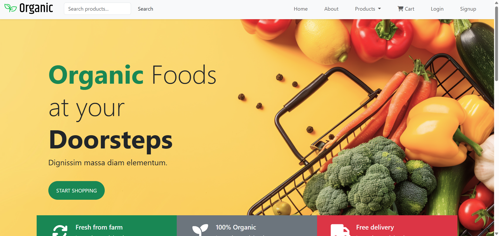
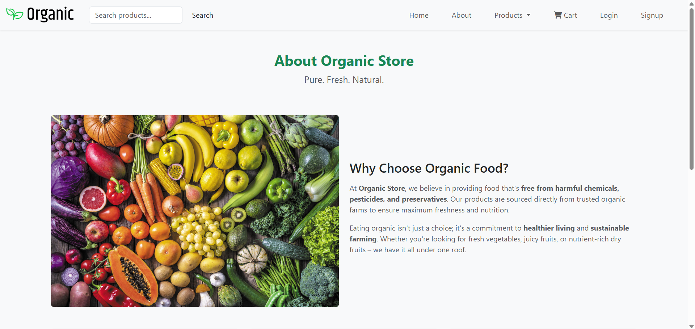
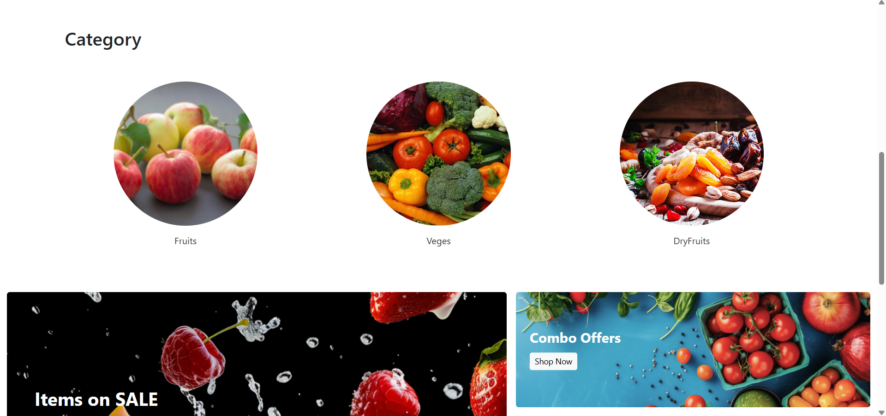
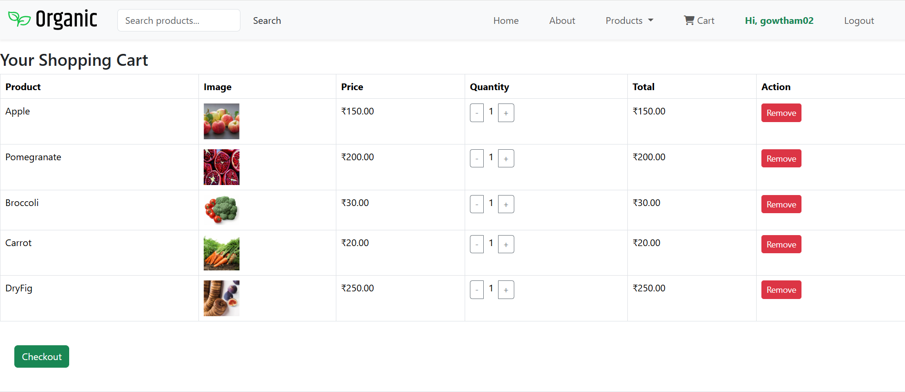
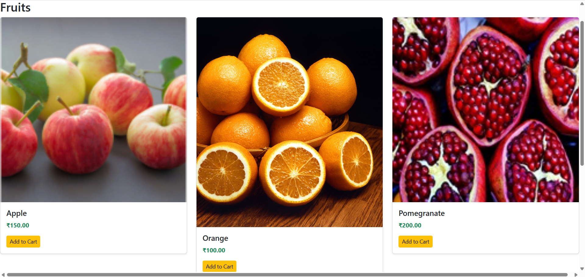
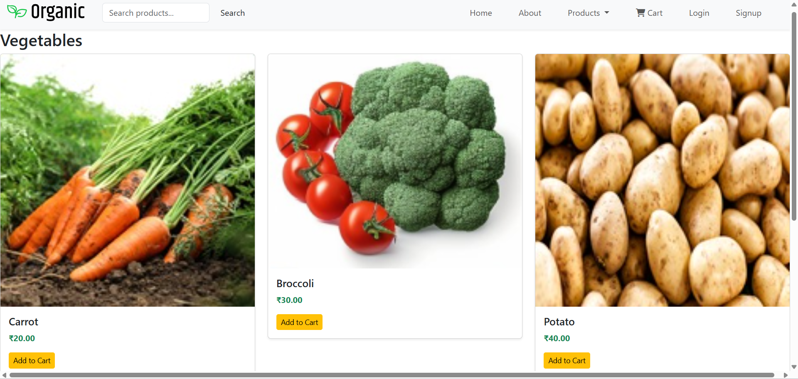
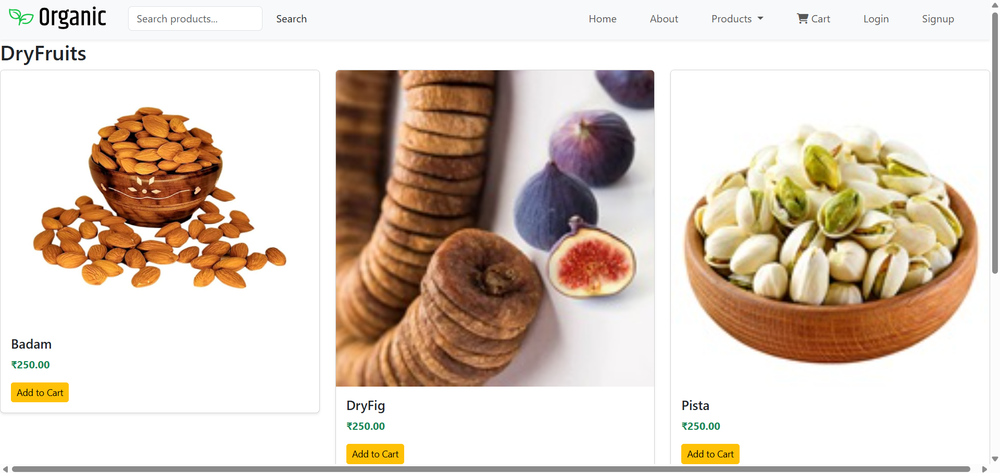
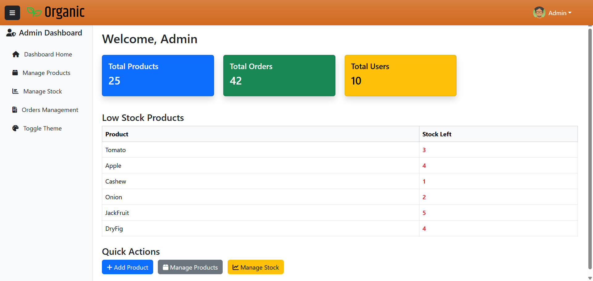
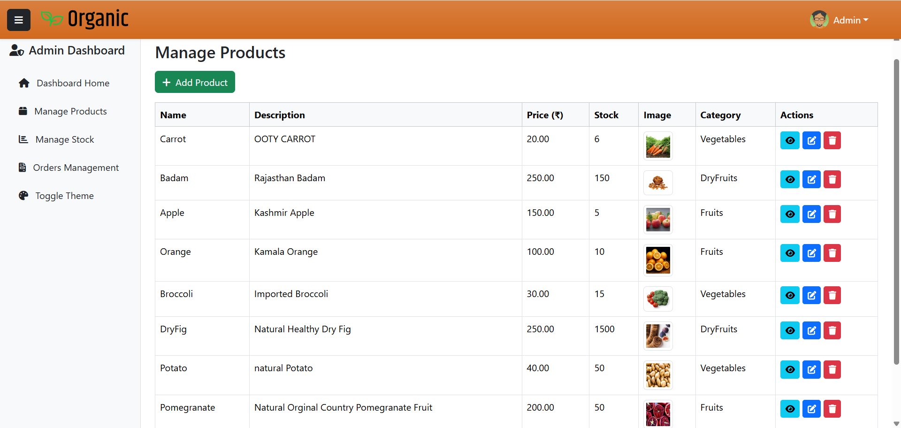

# Organic Food E-Commerce 🛒🌱

A demo e-commerce application showcasing **ASP.NET Core MVC**, **Entity Framework (Stored Procedures)**, and **SQL Server**.

---

## 🔑 Features
- User Registration & Login (ASP.NET Identity)
- View & Select Organic Products (Fruits, Vegetables, Dry Fruits) to add to Cart
- Add to Cart & Order Simulation (products can be added to cart; checkout/payment not included)
- Admin Dashboard (Manage Products & Orders)
  
---

## 🛠️ Tech Stack
- **Frontend:** HTML, CSS, JS, Bootstrap  
- **Backend:** ASP.NET Core MVC (C#) Entity Framework core 
- **Database:** SQL Server + Stored Procedures  
- **Tools:** Visual Studio 2022, GitHub  

---

## 📸 Screenshots
  
  
  
 






---

## ⚙️ Setup Instructions
1. Clone the repo:
   ```bash
   git clone https://github.com/Gowthamkumar91/OrganicProduct.git
2. Open the solution in **Visual Studio 2022.**
3. Update the **database connection string** in appsettings.json.
4. Run the project (Ctrl + F5).

  ## ⚠️ Note   
  This is a **demo showcase project** for portfolio purposes.
  - Cart functionality is working.
  - **Checkout & Payment integration are not included**, since the focus is on demonstrating:
  - ASP.NET Core MVC project structure
  - SQL Server integration with Stored Procedures
  - CRUD operations & admin dashboard
  
